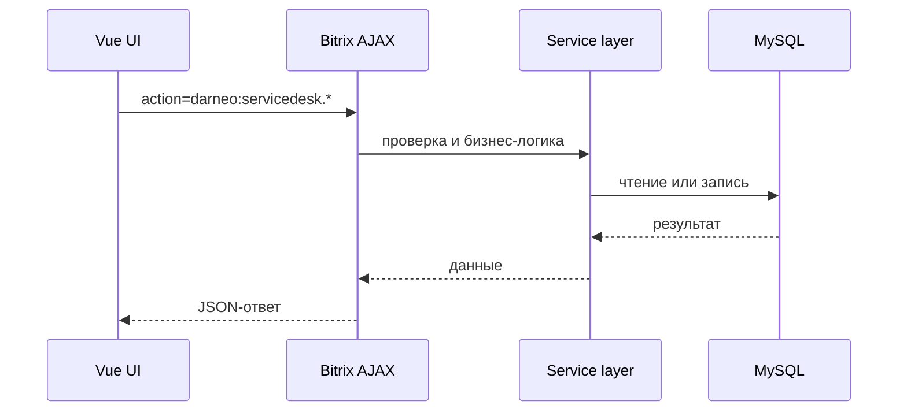

# Обзор архитектуры

Модуль состоит из фронтенда, backend-слоя Bitrix и update-пакетов.

## Основные части

| Часть | Где находится | За что отвечает |
| --- | --- | --- |
| Фронтенд | `app/` | Vue-интерфейс |
| Backend | `bitrix/modules/darneo.servicedesk/` | API, сервисы, ORM, агенты |
| Обновления | `iupdate/` | Файлы поставки |

## Поток запроса

## Правило для новых функций

Новая функция должна иметь:

- понятный пользовательский сценарий;
- backend-контракт;
- проверку прав;
- тесты по нужному слою;
- описание в документации, если функция видна пользователю или администратору.
