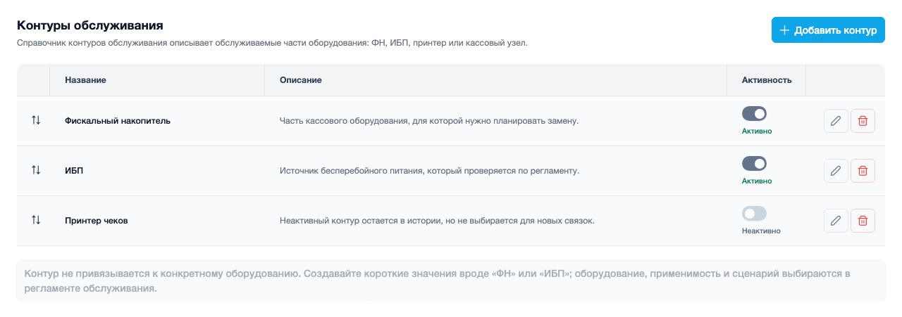
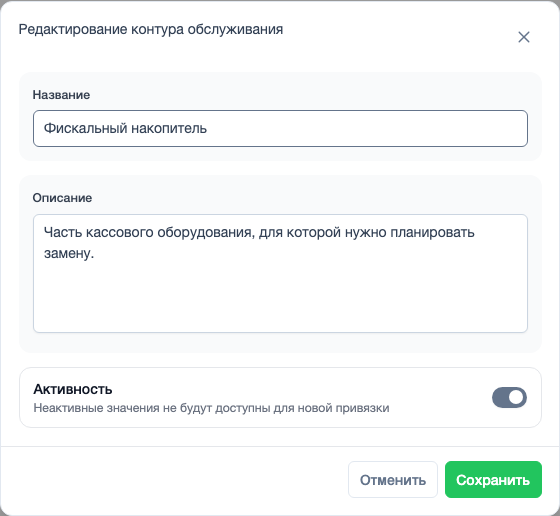

# Контуры обслуживания

Пример адреса страницы: `https://example.com/helpdesk/settings/maintenance_object/`

Контур обслуживания - это короткий справочник частей или зон оборудования, которые можно обслуживать отдельно.

Примеры контуров:

- фискальный накопитель;
- ИБП;
- принтер чеков;
- кассовый узел.

Контур сам по себе не привязывается к конкретной кассе или объекту. Он нужен как понятное название того, что будет обслуживаться. К оборудованию контур попадает позже через регламент.

## Список контуров

В списке видно название, описание, активность и действия. Порядок строк можно менять перетаскиванием.

{ .ds-screenshot }

Активный контур можно использовать в новых регламентах. Неактивный остается в истории, но не предлагается для новой настройки.

## Карточка контура

В форме заполняются только понятные пользователю поля: название, описание и активность.

{ .ds-screenshot }

Хорошее название должно быть коротким. Например, лучше написать **Фискальный накопитель**, чем длинное техническое описание модели.

## Когда нужен этот раздел

Открывайте контуры, когда нужно добавить новый вид обслуживаемой части оборудования или временно выключить старое значение из новых регламентов.
