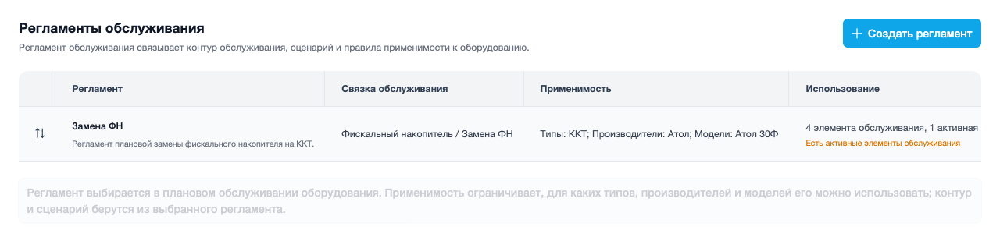
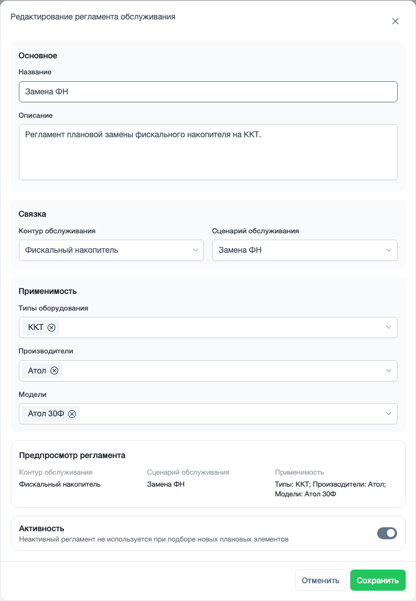

# Регламенты обслуживания

Пример адреса страницы: `https://example.com/helpdesk/settings/maintenance_regulation/`

Регламент обслуживания соединяет три вещи:

- какой контур обслуживается
- какой сценарий заявок запускать
- для какого оборудования этот регламент подходит.

Если контур - это «что обслуживаем», а сценарий - «как обслуживаем», то регламент - это готовое правило применения.

## Список регламентов

В списке видно название регламента, связку обслуживания, применимость, использование и активность.

{ .ds-screenshot }

Если регламент уже используется в плановых элементах или истории запусков, удалить его может быть нельзя. В этом случае он остается для истории, а для новых работ его можно отключить.

## Форма регламента

В форме выбирают контур обслуживания и сценарий обслуживания. Без активного контура и активного сценария создать регламент нельзя.

{ .ds-screenshot }

## Применимость

Применимость ограничивает, для какого оборудования доступен регламент:

- по типу оборудования
- по производителю
- по модели.

Если ничего не выбрать, регламент считается подходящим для всего оборудования.

{ .ds-screenshot }

## Когда нужен этот раздел

Открывайте регламенты, когда нужно собрать готовое правило обслуживания: выбрать контур, выбрать сценарий и указать, на какое оборудование это правило распространяется.
