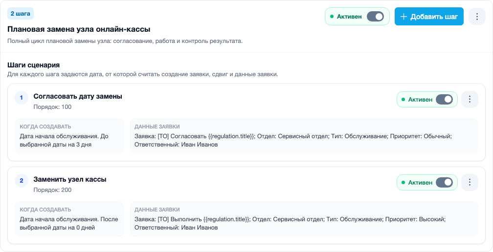
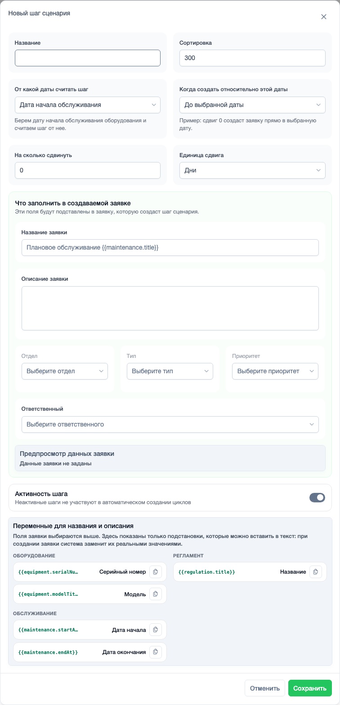
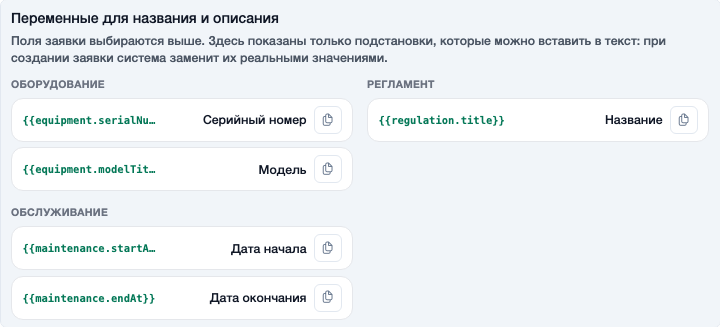

# Сценарии обслуживания

Пример адреса страницы: `https://example.com/helpdesk/settings/maintenance_scenario/`

Сценарий обслуживания описывает, какие заявки нужно создать для обслуживания и когда их создавать.

Сценарий не выбирает оборудование напрямую. Он становится рабочим только после того, как его привяжут к регламенту.

## Список и шаги

Слева находится список сценариев. Справа отображается выбранный сценарий и его шаги.

{ .ds-screenshot }

Шаг - это будущая заявка. Например, один шаг может создать заявку на согласование даты, второй - заявку на выполнение работы.

## Форма шага

В шаге задается дата, от которой считать создание заявки, сдвиг по времени и данные будущей заявки.

{ .ds-screenshot }

Пример: если нужно создать заявку за 3 дня до начала обслуживания, выбирают дату начала обслуживания, направление «до» и значение 3 дня.

## Переменные для текста заявки

В названии и описании заявки можно использовать переменные. При создании заявки система заменит их реальными значениями.

{ .ds-screenshot }

Пример: текст **Проверить {{regulation.title}}** в заявке превратится в понятное название выбранного регламента.

## Когда нужен этот раздел

Открывайте сценарии, когда нужно изменить цепочку работ: добавить этап, поменять сроки создания заявок или настроить поля, которые будут подставляться в будущие заявки.
